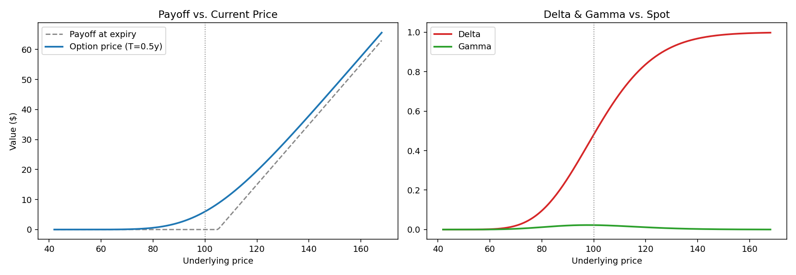

# 📈 Derivatives Pricing & Risk Analytics Engine

[](https://www.python.org/)
[](https://streamlit.io/)
[](#testing)
[](#license)

A from-scratch derivatives pricing library, no `QuantLib`, no pricing wrappers. Every formula is implemented directly from the underlying math and validated against known textbook values and internal consistency checks (put-call parity, Monte Carlo convergence to closed-form, implied-vol round-trips).

Built to understand *how* option pricing actually works under the hood, not just to call a library that does it.

---

## Table of Contents

- [What's in here](#whats-in-here)
- [Quick start](#quick-start)
- [Interactive dashboard](#interactive-dashboard)
- [The math](#the-math)
- [Project structure](#project-structure)
- [Testing](#testing)
- [Design notes & trade-offs](#design-notes--trade-offs)
- [Possible extensions](#possible-extensions)

---

## What's in here

| Module | What it does |
|---|---|
| `src/black_scholes.py` | Closed-form European option pricing + all five Greeks (Delta, Gamma, Vega, Theta, Rho) |
| `src/monte_carlo.py` | GBM path simulation for European **and** Asian (path-dependent, no closed form) options, with antithetic variates for variance reduction |
| `src/implied_vol.py` | Newton-Raphson implied volatility solver with a bisection fallback for near-zero-vega cases |
| `app/dashboard.py` | Interactive Streamlit UI — tune S, K, T, r, σ with sliders and watch prices, Greeks, and payoff diagrams update live |
| `tests/test_pricing.py` | 9 tests: textbook value check, put-call parity, Greek bounds, MC-vs-BS convergence, IV round-trip |

## Quick start

```bash
git clone https://github.com/Raaaj2005/derivatives-pricing-engine.git
cd derivatives-pricing-engine
pip install -r requirements.txt

# Run the CLI demo (prices a call three ways + solves implied vol)
python examples/demo.py

# Run the test suite
pytest tests/ -v

# Launch the interactive dashboard
streamlit run app/dashboard.py
```

<details>
<summary><strong>Expected demo output</strong> (click to expand)</summary>

```
=======================================================
EUROPEAN CALL — S=100, K=105, T=0.5y, r=5%, sigma=22%
=======================================================

[Black-Scholes]  price = 5.1438
[Monte Carlo]    price = 5.1448  (95% CI: +/- 0.0571)
[Asian, avg S]   price = 2.1227  (path-dependent)

Greeks (Black-Scholes):
  delta : +0.47005
  gamma : +0.02557
  vega  : +0.28130
  theta : -0.02269
  rho   : +0.20931

If the market quotes this call at 5.4010 (5% above BS fair value),
the implied volatility is 22.9140% vs. our input of 22.0000%, 
a rough proxy for a volatility 'skew' signal.
```
</details>

## Interactive dashboard

The Streamlit app lets you move S, K, T, r, and σ with sliders and see, live:

- Black-Scholes price side-by-side with a Monte Carlo estimate (with its 95% confidence interval, so you can see simulation error shrink as `n_sims` grows)
- The Asian option price for comparison, always cheaper than the equivalent European, since averaging the path reduces payoff variance
- A full Greeks table
- A payoff-vs-current-price diagram
- Delta and Gamma plotted across a range of spot prices
- A live implied volatility solver: type in any market price and get the σ that would justify it


*(Static preview of the payoff diagram and Delta/Gamma curves — the actual dashboard is interactive.)*

## The math

**Black-Scholes call price:**

```
d1 = [ln(S/K) + (r + σ²/2)·T] / (σ√T)
d2 = d1 - σ√T
C  = S·N(d1) - K·e^(-rT)·N(d2)
```

**GBM path simulation** (used for both the European sanity-check and the Asian option, which has no closed form under arithmetic averaging):

```
S_t = S_0 · exp[ (r - σ²/2)·t + σ·W_t ]
```

**Implied volatility** is solved by inverting Black-Scholes: given a market price, find the σ that reproduces it. Newton-Raphson does this in a handful of iterations using Vega as the derivative, except when Vega is near zero (deep ITM/OTM), where Newton-Raphson can diverge. In that case the solver falls back to bisection, which is slower but guaranteed to converge.

## Project structure

```
derivatives-pricing-engine/
├── src/
│   ├── black_scholes.py     # Closed-form pricing + Greeks
│   ├── monte_carlo.py       # GBM simulation, European + Asian
│   └── implied_vol.py       # Newton-Raphson + bisection IV solver
├── app/
│   └── dashboard.py         # Streamlit interactive UI
├── examples/
│   └── demo.py              # CLI walkthrough of all three modules
├── tests/
│   └── test_pricing.py      # pytest suite
├── assets/
│   └── payoff_and_greeks.png
├── requirements.txt
└── README.md
```

## Testing

```bash
pytest tests/ -v
```

9 tests covering:
- Black-Scholes price against a known textbook value (Hull, *Options, Futures & Other Derivatives*)
- Put-call parity: `C - P = S - K·e^(-rT)`
- Delta bounds (`[0,1]` for calls, `[-1,0]` for puts)
- Monte Carlo convergence to the closed-form price within its confidence interval
- Asian option pricing below the equivalent European (variance-reduction sanity check)
- Implied volatility round-trip accuracy
- Implied vol solver behavior at near-zero vega (deep ITM), where the price is nearly insensitive to σ and the solver has to fall back to bisection instead of failing

## Design notes & trade-offs

A few decisions worth knowing if this comes up in conversation:

- **Antithetic variates over other variance-reduction techniques.** Simple to implement correctly, and it directly attacks the main source of MC noise here, sampling error in the first moment of the standard normal draws, without needing a control variate model.
- **Vega threshold for the Newton-Raphson→bisection switch is deliberately conservative (`1e-8`).** Deep ITM/OTM options can have Newton-Raphson overshoot badly since the price surface is nearly flat in σ there; bisection trades speed for a convergence guarantee.
- **Theta is reported per calendar day, Vega and Rho per 1% move**, matching how they're typically quoted on a trading desk, rather than the raw per-unit mathematical derivative.
- **No external pricing libraries** (e.g. QuantLib), the point of this project was to implement the math directly, not to wrap an existing solution.

## Possible extensions

Ideas noted but not yet built:
- American option pricing via binomial trees (early exercise boundary)
- Local/stochastic volatility models (Heston) for a real volatility smile instead of a flat σ
- Historical data integration (`yfinance`) to compare model prices against live market quotes
- Greeks via automatic differentiation instead of closed-form, as a cross-check

---

## Author Details

**Name:** Raj Fatehveer Singh Brar
**Roll No.:** 102317090
**Email ID:** rbrar_be23@thapar.edu
**University:** Thapar Institute of Engineering and Technology
